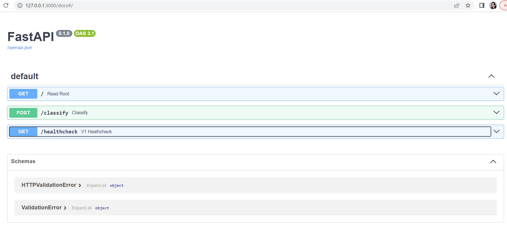

# PROJECT: HEART DIASEASE PREDICTION

## Produced by
Student: Guadalupe López Verdugo
ID:A01688491

## Introduction of the Project

In this project, you will learn about the basics of ML, how to apply it automatically, best practices, and the fundamental tools for developing software in the field of MLOps.

MLOps is a set of practices that combines software development, operations, and data science to automate and manage the entire lifecycle of machine learning models. This can save time and resources, and allow ML teams to focus on more strategic tasks.

## About the Project
The overall goal of this project is to create a robust and reproducible MLOps workflow for developing, training, and deploying machine learning models. In particular, we will build a KNN classification model to predict heart disease. KNN is a simple but powerful machine learning algorithm that can be used to classify data points into two or more categories. In this project, we will use KNN to classify patients with or without heart disease based on their medical characteristics..

## Explanation of the variables of the dataset
1. HeartDisease : Respondents that have ever reported having coronary heart disease (CHD) or myocardial infarction (MI).
2. BMI : Body Mass Index (BMI).
3. Smoking : Have you smoked at least 100 cigarettes in your entire life? ( The answer Yes or No ).
4. AlcoholDrinking : Heavy drinkers (adult men having more than 14 drinks per week and adult women having more than 7 drinks per week).
5. Stroke : (Ever told) (you had) a stroke?
6. PhysicalHealth : Now thinking about your physical health, which includes physical illness and injury, for how many days during the past 30 days was your physical health not good? (0-30 days).
7. MentalHealth : Thinking about your mental health, for how many days during the past 30 days was your mental health not good? (0-30 days).
8. DiffWalking : Do you have serious difficulty walking or climbing stairs?
9. Sex : Are you male or female?
10. AgeCategory: Fourteen-level age category.
11. Race : Imputed race/ethnicity value.
12. Diabetic : (Ever told) (you had) diabetes?
13. PhysicalActivity : Adults who reported doing physical activity or exercise during the past 30 days other than their regular job.
14. GenHealth : Would you say that in general your health is...
15. SleepTime : On average, how many hours of sleep do you get in a 24-hour period?
16. Asthma : (Ever told) (you had) asthma?
17. KidneyDisease : Not including kidney stones, bladder infection or incontinence, were you ever told you had kidney disease?
18. SkinCancer : (Ever told) (you had) skin cancer?

T
### Baseline

This MLOps project focuses on demonstrating the implementation of a complete workflow ranging from data preparation to exposing a local web service to making predictions using a linear regression model. The chosen data set is heart disease, which contains information on heart disease, health variables are included to predict whether or not the patient might have heart disease.

The project includes: software development, good practices, REST API and deployment of models using tools such as Docker and Docker Compose, which are essential to be able to bring a machine learning model into a productive environment. The project has focused on implementing the best practices of Continuous Integration, which allows to be able to evolve the code quickly, efficiently and with excellent guidelines.


### Links to experiments like notebooks


In the following link you will find the analysis and exploration of the data:

* [ Exploring-data-heartdisease.ipynb](docs/notebooks/heart-disease-prediction.ipynb)


## Setup

### Python version and packages to install

* Change the directory to the root folder.

* Create a virtual environment with Python 3.10:

Windows
 1.Run the following command to install the virtual environment: 
    py3.10 -m venv venv310

 2.Activate the virtual environment: Go to the SCRIPT folder and run the file .\activate:

 3.Once the virtual environment is activated, you can install the packages necessary for machine learning by running the following command (you need a requierement.txt file):
    pip install -r requirements.txt


## Resultados Model training: 


Model saved in ./models/KNeighbors_Classifier_output.pkl


## Usage

### Individual Fastapi and Use Deployment

* Run the next command to start the Titanic API locally

    ```bash
    uvicorn itesm_mlops_project.api.main:app --reload
    ```

#### Checking endpoints

1. Access `http://127.0.0.1:8000/`, you will see a message like this `"Heart Diasease classifier is all ready to go!"`
2. Access `http://127.0.0.1:8000/docs`, the browser will display something like this:

3. Try running the following predictions with the endpoint by writing the following values:
    * **Prediction 1**  
        Request body

        ```bash
        {
        "BMI": 20.34,
        "Smoking": 0,
        "AlcoholDrinking": 0,
        "Stroke": 1,
        "PhysicalHealth": 0,
        "MentalHealth": 0,
        "DiffWalking": 0,
        "Sex": 0,
        "Race_Asian": 0,
        "Race_Black": 0,
        "Race_Hispanic": 0,
        "Race_Other": 0,
        "Race_White": 1,
        "GenHealth_Fair": 0,
        "GenHealth_Good": 0,
        "GenHealth_Poor": 0,
        "GenHealth_Very_good": 1,
        "Diabetic": 0,
        "PhysicalActivity": 0,
        "SleepTime": 7,
        "Asthma": 0,
        "KidneyDisease": 0,
        "SkinCancer": 0
        }   
        ```

        Response body
        The output will be:

        ```bash
        "Resultado predicción: [0]"
        ```

    * **Prediction 2**  
        Request body

        ```bash
        {
        "BMI": 16.6,
        "Smoking": 1,
        "AlcoholDrinking":0,
        "Stroke": 0,
        "PhysicalHealth": 30,
        "MentalHealth": 0,
        "DiffWalking": 1,
        "Sex": 1,
        "Race_Asian": 0,
        "Race_Black": 0,
        "Race_Hispanic": 1,
        "Race_Other": 0,
        "Race_White": 1,
        "GenHealth_Fair": 0,
        "GenHealth_Good": 0,
        "GenHealth_Poor": 1,
        "GenHealth_Very_good": 0,
        "Diabetic": 1,
        "PhysicalActivity": 0,
        "SleepTime": 15,
        "Asthma": 1,
        "KidneyDisease": 0,
        "SkinCancer": 0
        }
        ```

        Response body
        The output will be:

        ```bash
        "Resultado predicción: [1]"
        ```

### Individual deployment of the API with Docker and usage

#### Build the image

* Ensure you are in the `heart_disease_prediction/` directory (root folder).
* Run the following code to build the image:

    ```bash
    docker-compose -f heart_disease_prediction/docker-compose.yml up --build
    ```

* Inspect the image created by running this command:

    ```bash
    docker images
    ```

    Output:

    ```bash
        REPOSITORY                          TAG       IMAGE ID       CREATED          SIZE 
        heartdisease-image                  latest    dd56ffc1495b   36 minutes ago   544MB
    ```

#### Run Heart Diasease REST API

1. Run the next command to start the `heartdisease-image ` image in a container.

    ```bash
    
    docker run -d --name heartdisease-c -p 8000:8000 heartdisease-image
    ```

2. Check the container running.

    ```bash
    docker ps -a
    ```

    Output:

    ```bash
    CONTAINER ID   IMAGE                 COMMAND                  CREATED          STATUS          PORTS                    NAMES
    172583ccc3cc   heartdisease-image  "uvicorn main:app --…"   55 seconds ago   Up 54 seconds    0.0.0.0:8000->8000/tcp   heartdisease-c
    ```

#### Checking endpoints for app

1. Access `http://127.0.0.1:8000/`, and you will see a message like this `"Heart Diasease classifier is all ready to go!"`
2. A file called `main_api.log` will be created automatically inside the container. We will inspect it below.
3. Access `http://127.0.0.1:8000/docs`, the browser will display something like this:
    

4. Try running the following predictions with the endpoint by writing the following values:
    * **Prediction 1**  
        Request body

        ```bash
        {
        "BMI": 20.34,
        "Smoking": 0,
        "AlcoholDrinking": 0,
        "Stroke": 1,
        "PhysicalHealth": 0,
        "MentalHealth": 0,
        "DiffWalking": 0,
        "Sex": 0,
        "Race_Asian": 0,
        "Race_Black": 0,
        "Race_Hispanic": 0,
        "Race_Other": 0,
        "Race_White": 1,
        "GenHealth_Fair": 0,
        "GenHealth_Good": 0,
        "GenHealth_Poor": 0,
        "GenHealth_Very_good": 1,
        "Diabetic": 0,
        "PhysicalActivity": 0,
        "SleepTime": 7,
        "Asthma": 0,
        "KidneyDisease": 0,
        "SkinCancer": 0
        }
        ```

        Response body
        The output will be:

        ```bash
        "Resultado predicción: [0]"
        ```

        

    * **Prediction 2**  
        Request body

        ```bash
        {
        "BMI": 16.6,
        "Smoking": 1,
        "AlcoholDrinking":0,
        "Stroke": 0,
        "PhysicalHealth": 30,
        "MentalHealth": 0,
        "DiffWalking": 1,
        "Sex": 1,
        "Race_Asian": 0,
        "Race_Black": 0,
        "Race_Hispanic": 1,
        "Race_Other": 0,
        "Race_White": 1,
        "GenHealth_Fair": 0,
        "GenHealth_Good": 0,
        "GenHealth_Poor": 1,
        "GenHealth_Very_good": 0,
        "Diabetic": 1,
        "PhysicalActivity": 0,
        "SleepTime": 15,
        "Asthma": 1,
        "KidneyDisease": 0,
        "SkinCancer": 0
        }
        ```

        Response body
        The output will be:

        ```bash
        "Resultado predicción: [1]"
        ```

        

#### Opening the logs

1. Run the command

    ```bash
    
    docker exec -it heartdisease-c bash
    ```

    Output:

    ```bash
    root@172583ccc3cc:/# 
    ```

2. Check the existing files:

    ```bash
    ls
    ```

    Output:

    ```bash
    Dockerfile  __pycache__  boot  etc   lib    lib64   main.py       media      mnt     opt        proc              root  sbin  sys  usr
    README.md   bin          dev   home  lib32  libx32  main_api.log  ml_models  models  predictor  requirements.txt  run   srv   tmp  var
    ```

3. Open the file `main_api.log` and inspect the logs with this command:

    ```bash
    vim main_api.log
    ```

    Output:

    ```log
    2023-08-23 17:37:11,816:main:main:INFO:Input values: [[34.3, 1, 0, 0, 30, 0, 1, 1, 0, 0, 1, 0, 0, 1, 0, 0, 0, 1, 0, 15, 1, 0, 0]]
    2023-08-23 17:37:11,823:main:main:INFO:Resultado predicción: [0]
    2023-08-23 17:37:12,013:main:main:INFO:Input values: [[34.3, 1, 0, 0, 30, 0, 1, 1, 0, 0, 1, 0, 0, 1, 0, 0, 0, 1, 0, 15, 1, 0, 0]]
    2023-08-23 17:37:12,025:main:main:INFO:Resultado predicción: [0]
    2023-08-23 17:37:12,222:main:main:INFO:Input values: [[34.3, 1, 0, 0, 30, 0, 1, 1, 0, 0, 1, 0, 0, 1, 0, 0, 0, 1, 0, 15, 1, 0, 0]]
    2023-08-23 17:37:12,230:main:main:INFO:Resultado predicción: [0]
    2023-08-23 17:37:12,426:main:main:INFO:Input values: [[34.3, 1, 0, 0, 30, 0, 1, 1, 0, 0, 1, 0, 0, 1, 0, 0, 0, 1, 0, 15, 1, 0, 0]]
    2023-08-23 17:37:12,433:main:main:INFO:Resultado predicción: [0]
    2023-08-23 17:38:01,185:main:main:INFO:Input values: [[16.6, 1, 0, 0, 30, 0, 1, 1, 0, 0, 1, 0, 1, 0, 0, 1, 0, 1, 0, 15, 1, 0, 0]]
    2023-08-23 17:38:01,195:main:main:INFO:Resultado predicción: [1]
    2023-08-23 17:38:02,908:main:main:INFO:Input values: [[16.6, 1, 0, 0, 30, 0, 1, 1, 0, 0, 1, 0, 1, 0, 0, 1, 0, 1, 0, 15, 1, 0, 0]]
    2023-08-23 17:38:02,915:main:main:INFO:Resultado predicción: [1]
    2023-08-23 17:38:03,063:main:main:INFO:Input values: [[16.6, 1, 0, 0, 30, 0, 1, 1, 0, 0, 1, 0, 1, 0, 0, 1, 0, 1, 0, 15, 1, 0, 0]]
    2023-08-23 17:38:03,073:main:main:INFO:Resultado predicción: [1]
    2023-08-23 17:47:09,629:main:main:INFO:Input values: [[20.34, 0, 0, 1, 0, 0, 0, 0, 0, 0, 0, 0, 1, 0, 0, 0, 1, 0, 0, 7, 0, 0, 0]]
    2023-08-23 17:47:09,638:main:main:INFO:Resultado predicción: [0]

    ```

4. Copy the logs to the root folder:

    ```bash
    docker cp titanic-c:/main_api.log .
    ```

    Output:

    ```bash
    Successfully copied 5.63kB to C:\Users\glverdugo\Documents\Maestria\MLops\Proyecto\.
    ```

#### Delete container and image

* Stop the container:

    ```bash
    docker stop heartdisease-c
    ```
* Deleted the container:

    ```bash
    docker rm heartdisease-c
    ```

* Verify it was deleted

    ```bash
    docker ps -a
    ```

    Output:

    ```bash
    CONTAINER ID   IMAGE     COMMAND   CREATED   STATUS    PORTS     NAMES
    ```

* Delete the image

    ```bash
    docker rmi heartdisease-image
    ```

    Output:

    ```bash
    Untagged: heartdisease-image:latest
    Deleted: sha256:49627360dd8205b1c9a360b475e3e0e09cbbf85ed3092b06e0b191368b1f9792
    ```

### Complete deployment of all containers with Docker Compose and usage

#### Create the network

First, create the network AIService by running this command:

```bash
docker network create AIservice
```

#### Run Docker Compose

* Ensure you are in the directory where the docker-compose.yml file is located

* Run the next command to start the App and Frontend APIs

    ```bash
    docker-compose -f heart_disease_prediction/docker-compose.yml up --build
    ```

    You will see something like this:

    ```bash
    ✔ Container heart_disease_prediction-app-1       Created                                                                                             0.0s 
    ✔ Container heart_disease_prediction-frontend-1  Created                                                                                             0.0s 
    Attaching to heart_disease_prediction-app-1, heart_disease_prediction-frontend-1
    heart_disease_prediction-app-1       | INFO:     Will watch for changes in these directories: ['/']
    heart_disease_prediction-app-1       | INFO:     Uvicorn running on http://0.0.0.0:8000 (Press CTRL+C to quit)
    heart_disease_prediction-app-1       | INFO:     Started reloader process [1] using StatReload
    heart_disease_prediction-frontend-1  | INFO:     Will watch for changes in these directories: ['/']
    heart_disease_prediction-frontend-1  | INFO:     Uvicorn running on http://0.0.0.0:3000 (Press CTRL+C to quit)
    heart_disease_prediction-frontend-1  | INFO:     Started reloader process [1] using StatReload
    heart_disease_prediction-app-1       | INFO:     Started server process [8]
    heart_disease_prediction-app-1       | INFO:     Waiting for application startup.
    heart_disease_prediction-app-1       | INFO:     Application startup complete.
    heart_disease_prediction-frontend-1  | INFO:     Started server process [8]
    heart_disease_prediction-frontend-1  | INFO:     Waiting for application startup.
    heart_disease_prediction-frontend-1  | INFO:     Application startup complete.
    ```

#### Checking endpoints in Frontend

1. Access `http://127.0.0.1:3000/`, and you will see a message like this `"Front-end Heart Diasease classifier is all ready to go!"`
2. A file called `frontend.log` will be created automatically inside the container. We will inspect it below.
3. Access `http://127.0.0.1:3000/docs`, the browser will display something like this:
    

4. Try running the following predictions with the endpoint `classify` by writing the following values:
    * **Prediction 1**  
        Request body

        ```bash
        {
        "BMI": 20.34,
        "Smoking": 0,
        "AlcoholDrinking": 0,
        "Stroke": 1,
        "PhysicalHealth": 0,
        "MentalHealth": 0,
        "DiffWalking": 0,
        "Sex": 0,
        "Race_Asian": 0,
        "Race_Black": 0,
        "Race_Hispanic": 0,
        "Race_Other": 0,
        "Race_White": 1,
        "GenHealth_Fair": 0,
        "GenHealth_Good": 0,
        "GenHealth_Poor": 0,
        "GenHealth_Very_good": 1,
        "Diabetic": 0,
        "PhysicalActivity": 0,
        "SleepTime": 7,
        "Asthma": 0,
        "KidneyDisease": 0,
        "SkinCancer": 0
        }
        ```

        Response body
        The output will be:

        ```bash
        "Resultado predicción: [0]"
        ```

        

    * **Prediction 2**  
        Request body

        ```bash
        {
        "BMI": 16.6,
        "Smoking": 1,
        "AlcoholDrinking":0,
        "Stroke": 0,
        "PhysicalHealth": 30,
        "MentalHealth": 0,
        "DiffWalking": 1,
        "Sex": 1,
        "Race_Asian": 0,
        "Race_Black": 0,
        "Race_Hispanic": 1,
        "Race_Other": 0,
        "Race_White": 1,
        "GenHealth_Fair": 0,
        "GenHealth_Good": 0,
        "GenHealth_Poor": 1,
        "GenHealth_Very_good": 0,
        "Diabetic": 1,
        "PhysicalActivity": 0,
        "SleepTime": 15,
        "Asthma": 1,
        "KidneyDisease": 0,
        "SkinCancer": 0
        }
        ```

        Response body
        The output will be:

        ```bash
        "Resultado predicción: [1]"
        ```

        

#### Opening the logs in Frontend

Open a new terminal, and execute the following commands:

1. Copy the `frontend` logs to the root folder:

    ```bash
    docker cp heart_disease_prediction-frontend-1:/frontend.log .
    ```

    Output:

    ```bash
    Successfully copied 3.58kB to C:\Users\glverdugo\Documents\Maestria\MLops\Proyecto\heart_disease_prediction\.
    ```

2. You can inspect the logs and see something similar to this:

    ```bash
        INFO: 2023-08-23 19:17:06,257|main|Front-end is all ready to go!
    DEBUG: 2023-08-23 19:17:34,775|main|Incoming input in the front end: {'BMI': 16.6, 'Smoking': 1, 'AlcoholDrinking': 0, 'Stroke': 0, 'PhysicalHealth': 30, 'MentalHealth': 0, 'DiffWalking': 1, 'Sex': 1, 'Race_Asian': 0, 'Race_Black': 0, 'Race_Hispanic': 1, 'Race_Other': 0, 'Race_White': 1, 'GenHealth_Fair': 0, 'GenHealth_Good': 0, 'GenHealth_Poor': 1, 'GenHealth_Very_good': 0, 'Diabetic': 1, 'PhysicalActivity': 0, 'SleepTime': 15, 'Asthma': 1, 'KidneyDisease': 0, 'SkinCancer': 0}
    DEBUG: 2023-08-23 19:17:35,379|main|Prediction: "Resultado predicción: [1]"
    DEBUG: 2023-08-23 19:53:06,589|main|Incoming input in the front end: {'BMI': 20.34, 'Smoking': 0, 'AlcoholDrinking': 0, 'Stroke': 1, 'PhysicalHealth': 0, 'MentalHealth': 0, 'DiffWalking': 0, 'Sex': 0, 'Race_Asian': 0, 'Race_Black': 0, 'Race_Hispanic': 0, 'Race_Other': 0, 'Race_White': 1, 'GenHealth_Fair': 0, 'GenHealth_Good': 0, 'GenHealth_Poor': 0, 'GenHealth_Very_good': 1, 'Diabetic': 0, 'PhysicalActivity': 0, 'SleepTime': 7, 'Asthma': 0, 'KidneyDisease': 0, 'SkinCancer': 0}
    DEBUG: 2023-08-23 19:53:06,640|main|Prediction: "Resultado predicción: [0]"
    DEBUG: 2023-08-23 19:53:08,053|main|Incoming input in the front end: {'BMI': 20.34, 'Smoking': 0, 'AlcoholDrinking': 0, 'Stroke': 1, 'PhysicalHealth': 0, 'MentalHealth': 0, 'DiffWalking': 0, 'Sex': 0, 'Race_Asian': 0, 'Race_Black': 0, 'Race_Hispanic': 0, 'Race_Other': 0, 'Race_White': 1, 'GenHealth_Fair': 0, 'GenHealth_Good': 0, 'GenHealth_Poor': 0, 'GenHealth_Very_good': 1, 'Diabetic': 0, 'PhysicalActivity': 0, 'SleepTime': 7, 'Asthma': 0, 'KidneyDisease': 0, 'SkinCancer': 0}
    DEBUG: 2023-08-23 19:53:08,085|main|Prediction: "Resultado predicción: [0]"
    ```

#### Opening the logs in App

Open a new terminal, and execute the following commands:

1. Copy the `app` logs to the root folder:

    ```bash
    docker cp heart_disease_prediction-app-1:/main_api.log .
    ```

    Output:

    ```bash
    Successfully copied 6.14kB to C:\Users\glverdugo\Documents\Maestria\MLops\Proyecto\heart_disease_prediction\. 
    ```

2. You can inspect the logs and see something similar to this:

    ```bash
    2023-08-23 17:15:56,221:main:main:INFO:Heart Diasease classifier is all ready to go!
    2023-08-23 17:16:08,511:main:main:INFO:Heart Diasease classifier is all ready to go!
    2023-08-23 17:16:22,204:main:main:INFO:Input values: [[0.0, 0, 0, 0, 0, 0, 0, 0, 0, 0, 0, 0, 0, 0, 0, 0, 0, 0, 0, 0, 0, 0, 0]]
    2023-08-23 17:16:22,233:main:main:INFO:Resultado predicción: [0]
    2023-08-23 17:25:43,932:main:main:INFO:Heart Diasease classifier is all ready to go!
    2023-08-23 17:26:23,316:main:main:INFO:Input values: [[25.0, 1, 1, 1, 1, 0, 0, 1, 0, 0, 1, 0, 0, 0, 0, 0, 0, 0, 0, 4, 0, 0, 1]]
    2023-08-23 17:26:23,323:main:main:INFO:Resultado predicción: [0]
    2023-08-23 17:31:36,481:main:main:INFO:Heart Diasease classifier is all ready to go!
    2023-08-23 17:36:58,526:main:main:INFO:Input values: [[34.3, 1, 0, 0, 30, 0, 1, 1, 0, 0, 1, 0, 0, 1, 0, 0, 0, 1, 0, 15, 1, 0, 0]]
    2023-08-23 17:36:58,532:main:main:INFO:Resultado predicción: [0]
    2023-08-23 17:37:10,133:main:main:INFO:Input values: [[34.3, 1, 0, 0, 30, 0, 1, 1, 0, 0, 1, 0, 0, 1, 0, 0, 0, 1, 0, 15, 1, 0, 0]]
    2023-08-23 17:37:10,145:main:main:INFO:Resultado predicción: [0]
    2023-08-23 17:37:10,698:main:main:INFO:Input values: [[34.3, 1, 0, 0, 30, 0, 1, 1, 0, 0, 1, 0, 0, 1, 0, 0, 0, 1, 0, 15, 1, 0, 0]]
    2023-08-23 17:37:10,704:main:main:INFO:Resultado predicción: [0]
    2023-08-23 17:37:10,889:main:main:INFO:Input values: [[34.3, 1, 0, 0, 30, 0, 1, 1, 0, 0, 1, 0, 0, 1, 0, 0, 0, 1, 0, 15, 1, 0, 0]]
    2023-08-23 17:37:10,895:main:main:INFO:Resultado predicción: [0]
    2023-08-23 17:37:11,063:main:main:INFO:Input values: [[34.3, 1, 0, 0, 30, 0, 1, 1, 0, 0, 1, 0, 0, 1, 0, 0, 0, 1, 0, 15, 1, 0, 0]]
    2023-08-23 17:37:11,069:main:main:INFO:Resultado predicción: [0]
    2023-08-23 17:37:11,232:main:main:INFO:Input values: [[34.3, 1, 0, 0, 30, 0, 1, 1, 0, 0, 1, 0, 0, 1, 0, 0, 0, 1, 0, 15, 1, 0, 0]]
    2023-08-23 17:37:11,240:main:main:INFO:Resultado predicción: [0]
    2023-08-23 17:37:11,409:main:main:INFO:Input values: [[34.3, 1, 0, 0, 30, 0, 1, 1, 0, 0, 1, 0, 0, 1, 0, 0, 0, 1, 0, 15, 1, 0, 0]]
    2023-08-23 17:37:11,417:main:main:INFO:Resultado predicción: [0]
    2023-08-23 17:37:11,652:main:main:INFO:Input values: [[34.3, 1, 0, 0, 30, 0, 1, 1, 0, 0, 1, 0, 0, 1, 0, 0, 0, 1, 0, 15, 1, 0, 0]]
    2023-08-23 17:37:11,659:main:main:INFO:Resultado predicción: [0]
    2023-08-23 17:37:11,816:main:main:INFO:Input values: [[34.3, 1, 0, 0, 30, 0, 1, 1, 0, 0, 1, 0, 0, 1, 0, 0, 0, 1, 0, 15, 1, 0, 0]]
    2023-08-23 17:37:11,823:main:main:INFO:Resultado predicción: [0]
    2023-08-23 17:37:12,013:main:main:INFO:Input values: [[34.3, 1, 0, 0, 30, 0, 1, 1, 0, 0, 1, 0, 0, 1, 0, 0, 0, 1, 0, 15, 1, 0, 0]]
    2023-08-23 17:37:12,025:main:main:INFO:Resultado predicción: [0]
    2023-08-23 17:37:12,222:main:main:INFO:Input values: [[34.3, 1, 0, 0, 30, 0, 1, 1, 0, 0, 1, 0, 0, 1, 0, 0, 0, 1, 0, 15, 1, 0, 0]]
    2023-08-23 17:37:12,230:main:main:INFO:Resultado predicción: [0]
    2023-08-23 17:37:12,426:main:main:INFO:Input values: [[34.3, 1, 0, 0, 30, 0, 1, 1, 0, 0, 1, 0, 0, 1, 0, 0, 0, 1, 0, 15, 1, 0, 0]]
    2023-08-23 17:37:12,433:main:main:INFO:Resultado predicción: [0]
    2023-08-23 17:38:01,185:main:main:INFO:Input values: [[16.6, 1, 0, 0, 30, 0, 1, 1, 0, 0, 1, 0, 1, 0, 0, 1, 0, 1, 0, 15, 1, 0, 0]]
    2023-08-23 17:38:01,195:main:main:INFO:Resultado predicción: [1]
    2023-08-23 17:38:02,908:main:main:INFO:Input values: [[16.6, 1, 0, 0, 30, 0, 1, 1, 0, 0, 1, 0, 1, 0, 0, 1, 0, 1, 0, 15, 1, 0, 0]]
    2023-08-23 17:38:02,915:main:main:INFO:Resultado predicción: [1]
    2023-08-23 17:38:03,063:main:main:INFO:Input values: [[16.6, 1, 0, 0, 30, 0, 1, 1, 0, 0, 1, 0, 1, 0, 0, 1, 0, 1, 0, 15, 1, 0, 0]]
    2023-08-23 17:38:03,073:main:main:INFO:Resultado predicción: [1]
    2023-08-23 17:47:09,629:main:main:INFO:Input values: [[20.34, 0, 0, 1, 0, 0, 0, 0, 0, 0, 0, 0, 1, 0, 0, 0, 1, 0, 0, 7, 0, 0, 0]]
    2023-08-23 17:47:09,638:main:main:INFO:Resultado predicción: [0]
    2023-08-23 19:17:35,356:main:main:INFO:Input values: [[16.6, 1, 0, 0, 30, 0, 1, 1, 0, 0, 1, 0, 1, 0, 0, 1, 0, 1, 0, 15, 1, 0, 0]]
    2023-08-23 19:17:35,376:main:main:INFO:Resultado predicción: [1]
    2023-08-23 19:53:06,631:main:main:INFO:Input values: [[20.34, 0, 0, 1, 0, 0, 0, 0, 0, 0, 0, 0, 1, 0, 0, 0, 1, 0, 0, 7, 0, 0, 0]]
    2023-08-23 19:53:06,638:main:main:INFO:Resultado predicción: [0]
    2023-08-23 19:53:08,076:main:main:INFO:Input values: [[20.34, 0, 0, 1, 0, 0, 0, 0, 0, 0, 0, 0, 1, 0, 0, 0, 1, 0, 0, 7, 0, 0, 0]]
    2023-08-23 19:53:08,083:main:main:INFO:Resultado predicción: [0]
    ```

### Delete the containers with Docker Compose

1. Stop the containers that have previously been launched with `docker-compose up`.

    ```bash
    docker-compose -f heart_disease_prediction/docker-compose.yml stop
    ```

    Output:

    ```bash
    [+] Stopping 2/2                                                             ~
    ✔ Container heart_disease_prediction-frontend-1  Stopped 0.9s 
    ✔ Container heart_disease_prediction-app-1       Stopped 0.9s   
    ```

2. Delete the containers stopped from the stage.

    ```bash
    docker-compose -f heart_disease_prediction/docker-compose.yml rm 
    ```

    Output:

    ```bash
    [+] Removing 2/0                                         ~
    ✔ Container heart_disease_prediction-app-1       Removed    0.0s 
    ✔ Container heart_disease_prediction-frontend-1  Removed    0.0s  
    ```

## Resources

Here you will find information about this project and more.

### Information sources


* [MLOps Project GitHub Repository](https://github.com/GlVerdugo/ProyectoFinal/tree/main/heart_disease_prediction)

## Contact information

* **Credits**

    ------------

  * **Development Lead**

    * Guadalupe López <lulover18@gmail.com>
    * [LinkedIn](https://www.linkedin.com/in/lupita-lópez-verdugo/)
